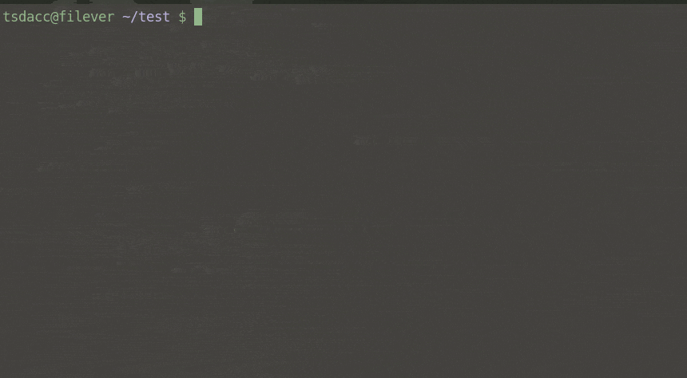

# FILEVER: cli file backup solution #

### Installation

```sh
$ pip3 install filever
```

### Description

*Filever* is a utility designed for administrators to quickly and easily backup specific files whilst working from the CLI.

Instead of this:

```sh
$ cp -p ./someapp.conf ./someapp.conf.orig
```

Do this:

```sh
$ fver -b ./someapp.conf -c original
```

**Why?**

 - easily swap between multiple versions of a file (handy when testing different options in a config file)
 - keep your directories clean (backed up files are kept hidden in a vault)
 - remembers the permissions of the file when backed up
 - ability to restore to a new name if required
 - ensures you don't back up duplicates
 - warns you before accidentally restoring over a file you haven't yet backed up
 - browse vault contents for specific files or directories, or even the entire vault
 - ability to delete files from the vault you no longer need

### Dependencies

 - Python 3
 - [pick](https://github.com/wong2/pick)

### Instructions ###

Run 'fver -h' for all syntax

### Demo ###



### Examples ###

| To do this | Run this |
| ---------- | -------- |
| Backup file.txt in the current directory | ```fver -b ./file.txt``` |
| Backup file.txt in the current directory with a comment | ```fver -b ./file.txt -c hello``` | 
| See backed up versions of existing file.txt in current directory | ```fver -l ./file.txt``` | 
| See all files backed up in current directory | ```fver -l .``` |
| See entire vault contents | ```fver -l ALL``` | 
| Restore backed up version of existing file.txt in current directory | ```fver -r ./file.txt``` | 
| Restore latest backed up version of existing file.txt in current directory | ```fver -r ./file.txt --latest``` | 
| Restore backed up version of existing file.txt in current directory with new name | ```fver -r ./file.txt -n ./file-restored.txt``` | 
| Restore any file that was backed up in current directory (i.e. not sure of the filename) | ```fver -r .``` | 
| Restore any file in the vault that matches the string ".txt" (i.e. grep) | ```fver -r .txt``` | 
| Restore any file in the vault that matches the string ".doc" to the current directory with new name "restored.doc" | ```fver -r .doc -n ./restored.doc``` | 
| Delete a backup of existing file.txt in current directory | ```fver -d ./file.txt``` | 
| Choose from a list of backed up files in current directory to delete | ```fver -d .``` |
| Choose from a list of files within the entire vault to delete whose filename contains ".txt" | ```fver -d .txt``` |

### Tips ###

 - Config file location is set to ```~/.config/filever/filever.conf```

 - If the vault does not exist, it will be created the first time *filever* is run. Likewise, if a config file does not exist, a default one will be created at ```~/.config/filever/filever.conf```

 - Consider setting an alias for fver to shorten the command. EG:

    ```sh
    alias fv='fver'
    ```

 - Consider placing your vault in a cloud sync'd folder for extra redundancy

### Note ###

* *Filever* is not intended as a complete *system* backup solution, nor is it a complete *version-control* system (i.e. GIT). It is merely a command-line tool to help with your day-to-day workflow.

### contact ###

* monotone.the.musical@gmail.com
* [Issues](https://github.com/monotone-the-musical/filever/issues)
